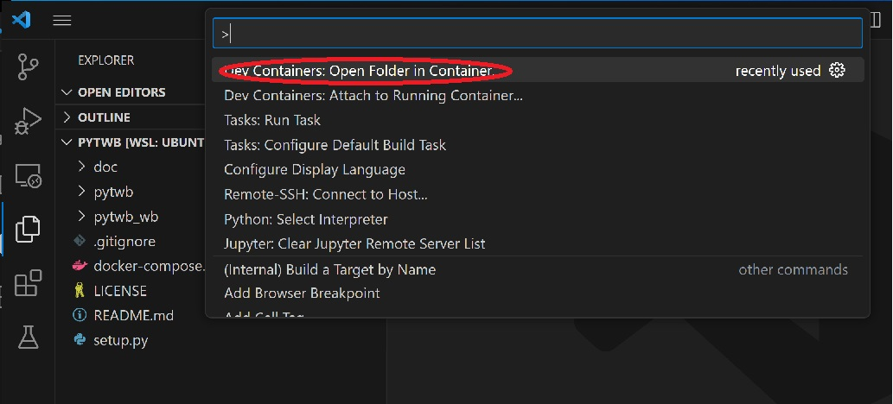
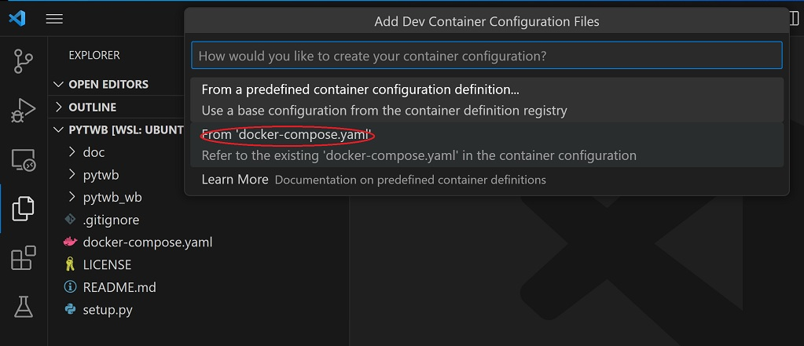

# pytwb_tutorial: tutorial for using pytwb
pytwb is a workbench for creating ROS applications based on py_trees and py_trees_ros frameworks.
pytwb is assumed to be used with VSCode under docker environment. It generates and runs ROS packages on a command line basis. Although based on py_trees, it is possible to define behavior trees using XML, because pytwb is equipped with the XML parser.  With just writing XML and Python codes by VSCode, it becomes possible to execute them interactively as a ROS application.

## Getting Started
### Prerequirement
pytwb is a normal Python application and can be installed locally, but it is recommended to use docker to build ROS applications and create an execution environment by using pytwb. Development is done by first generating a docker under the control of VSCode. Therefore, the docker environment and VSCode must be available for the Ubuntu-22 environment. It's standard to do the development in WSL. VSCode must have a plugin installed for docker.

### Installation
The entire installation process is managed by VSCode and you don't need to build explicitly.
First, you need to retrieve the pytwb module.

```
git clone https://github.com/momoiorg-repository/pytwb_tutorial.git
cd pytwb_tutorial
```
(at "pytwb_tutorial" directory)  
start VSCode by "code ."  
press “F1”  
 -> select “Dev Containers: Open Folder in Container” tab  
  
 -> select current directory as work directory  
 -> select “From ‘docker-compose.yaml’  
  
the corresponding docker will be started and VSCode is attached automatically.  
Set working directory of VSCode by its "Open Folder" menu to “/root/pytwb_ws”  (1st time only. Automatically set after creating a package).  
Install VSCode "Python in Dev Container" plugin (1st time only).  
Select “main.py” and press F5.  
The “> “ prompt will be displayed in the Terminal section.   This implies that pytwb command session has been started successfully.  
The command input  

\> help

gives you the available command description.  
And by inputting

\> create sample

the “sample” package will be created.

## Tutorial
- [tutorial](doc/tutorial.md)

## Document
- [overview](doc/overview.md)
## Sample code
- [pytwb_demo](https://github.com/momoiorg-repository/pytwb_demo)
