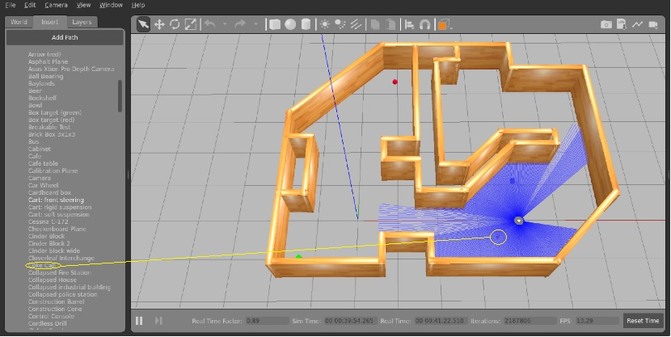
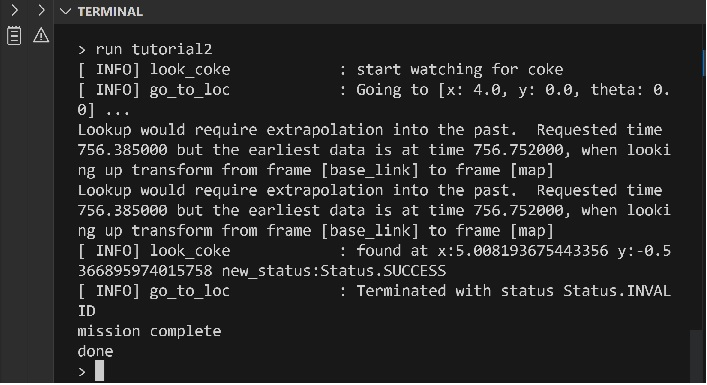
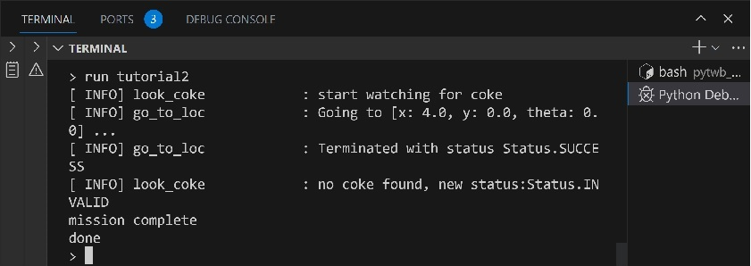

# pytwb tutorial
In this tutorial, we will explain the procedure from the beginning to create a ROS application using pytwb using an example of creating a program equivalent to pytwb_demo.
The execution environment assumes Windows with WSL and docker desktop installed.

## Installation and workspace creation
First, install the pytwb tools from GitHub. This includes not only programs, but also the underlying directories needed to launch multiple ROS packages. After cloning from GitHub, the files under pytwb will be used repeatedly, so please install with that in mind.

### Installation
Assume WSL with docker environment installed as environment. There, you should have VSCode installed.
First, install pytwb from GitHub. Open a WSL terminal and run:  
\$ git clone https://github.com/momoiorg-repository/pytwb_tutorial.git  
\$ cd pytwb_tutorial  
\$ code .  

The 'pytwb_tutorial' directory will be the foundation for future project launches.

Next, start docker that runs pytwb. From docker-compose.yaml within VSCode do the following:
- press ‘F1’
- select ‘Open Folder in Container’
- press ‘OK’
- select ‘From docker-compose.yaml’
- press ‘OK’
- open ‘/root/pytwb_ws’ folder from ‘Open Folder’ menu
- install ‘Python’ extension
- execute ‘main.py’ program by pressing ‘F5’ from Explorer menu

'no current package' is displayed in VSCode's TERMINAL, followed by the pytwb command prompt '>', so enter the 'help' command to know the type of pytwb command.
Installation is now complete.

　This creates a default ROS workspace 'pytwb_ws' in docker at '/root/pytwb_ws'. It has the same structure as the standard workspace of ROS2 and serves as the base for program development. Programs can be created with VSCode within docker, and can be seen from outside docker by the volume mount mechanism. This also makes it easier to install other programs.

There are multiple ways to start pytwb. Within docker, it can be executed as a normal command from the Linux command prompt. Also, as described below, when you create a package, the main program 'mapin.py' for each package is automatically created and can be run directly from VSCode within docker. In the early stages of development, it's efficient to run pytwb entirely under VSCode's debug mode, as mentioned here. This means that all your programs will also run in debug mode, and you can, for example, set breakpoints and read the values of variables.

### Create a package
Next, create a package to implement the sample application. This time, name it 'pytwb_mydemo'. From the pytwb command prompt,  
\> create pytwb_mydemo  

will create the 'pytwb_mydemo' package in the pytwb_ws workspace. The location of the directory is the same as a standard ROS application.  Namely, the location of the package is:  
/root/pytwb_ws/src/pytwb_mydemo  


## Create an application
### Creating a parts base
In this tutorial, the goal is to create an application with the same contents as [pytwb_demo](https://github.com/momoiorg-repository/pytwb_demo) from scratch, but since it is difficult to create behavior code written in Python from scratch, we will reuse the code created by pytwb_demo. pytwb supports such behavior-based code reuse.

  Execute the following from the pytwb command prompt in docker.  
\> cd  
\> git clone https://github.com/momoiorg-repository/pytwb_demo.git  
\> use pytwb_demo/pytwb_ws  

This makes the behavior code from pytwb_demo reusable from projects you are developing with pytwb. Program files collected from pytwb_demo will be copied to behavior, trees, lib under ~/.pytwb and will be available for all future packages. This shows that a kind of 'component base' by the unit of behaviors has been created under ~/.pytwb.

　During the development period, the path is set to this parts base (~/.pytwb), so the behavior, trees, and lib here can be used directly from within the program under development. Once everything is complete, use the 'finalize' command as described below to copy all necessary files under the pytwb_ws workspace to make it work on its own.

After saving the necessary components with the 'use' command, you can delete the source package (pytwb_demo in this case).

Similarly, xml files used in the following sample is also prepared in pytwb_tutorial itself, so import them by:  
\> use tutorial

### Installation of required programs
In order to run the behavior introduced from pytwb_demo, it is necessary to install some external software. From the pytwb command prompt,  
\> cd /root/pytwb_ws  
\> apt update  
\> apt install ros-humble-navigation2 ros-humble-py-trees ros-humble-py-trees-ros python3-opencv libopencv-contrib-dev python3-tk libqt5svg5-dev ros-humble-navigation2 ros-humble-rmw-cyclonedds-cpp  

The types of software installed during the development of pytwb_mydemo are recorded and used automatically to generate future Dockerfiles.

Additionally, installing Python libraries with pip3 as follows:  
\> pip3 install matplotlib transforms3d pyquaternion  

Further, install of the vector_map library is needed. From the pytwb command prompt,  
\> cd /usr/local/lib  
\> git clone https://github.com/RobotSpatialCognition/vector_map.git  
\> cd vector_map  
\> !pip3 install -e .　 (Be sure to add '!')  

Also, in order to connect to the simulation environment, it is necessary to set environment variables from the pytwb command prompt.  
\> env RMW_IMPLEMENTATION rmw_cyclonedds_cpp  

It is enough to do the above only once. With these tasks, the program is ready for reuse. Now quit pytwb and restart it. After that, to try, from the pytwb command prompt,  
\> behaviors  

will display the list of behaviors that have become available.  

In this state,  
\> trees  

will also display the list of behavior trees that are now available. The tutorial1.xml - turorial4.xml examples below can be typed in by yourself, or you can use them from here.

### Installation of simulation environment
Now you are ready to create a ROS application with behavior trees. Next, create each behavior and behavior tree and run the program. To run a ROS application, you need a real robot or a simulated environment. Here, install sea-bass' [turtlebot3_behavior_demo](https://github.com/sea-bass/turtlebot3_behavior_demos) and use it as a simulation environment.

Open another WSL terminal and set the DISPLAY environment variable correctly. In many cases, the DISPLAY environment variable should be :0, but please check by running xeyes etc. in advance.

After this,  
\$ git clone https://github.com/sea-bass/turtlebot3_behavior_demos.git  
\$ cd turtlebot3_behavior_demos  
\$ docker compose build  
\$ docker compose up demo-world  

These should bring up the Gazebo and Rviz screens.

In addition, in order to switch the camera of turtlebot3 to simulate to Realsense, rewrite the sdf file in the running turtlebot3_behavior_demos docker. From the command prompt on the WSL side, run:  
\$ cd pytwb_tutorial/tutorial  
\$ ./set_model  
\$ docker restart turtlebot3_behavior_demos-demo-world-1  

### Initial behavior tree
Let's move the simulated turtlebot3 next. At its core is the GoToPose behavior. The entire behavior tree looks like this:  

tutorial1.xml  

```
<root>  
    <BehaviorTree ID="tutorial1">  
        <Sequence name="main">
            <SetBlackboard name="set_bloackboard" key="target_pose" value="[(4.0, 0.0, 0.0)]"/>
            <GoToPose name="go_to_loc"/>
        </Sequence>
    </BehaviorTree>
</root>
```

You can write the code by yourself and save as /root/pytwb_ws/src/pytwb_tutorial/pytwb_tutorial/trees/tutorial1.xml, or you can just do nothing and reuse the code from parts base which is already initialized. 

SetBlackboard sets coordinates of the destination. The x-coordinate value, y-coordinate value, and direction are described in Python tuple format. Values enclosed in [] are evaluated as Python variable values. GoToPose is the command that does the actual movement.

To run this behavior tree, you must first write a procedure that performs application-specific initialization. This time, an app.py file is automatically generated under  /root/pytwb_ws/src/pytwb_mydemo/pytwb_mydemo, and rewrite the following line:  
\# insert application specific initialization routine here  

so that the entire app.py file looks like this:  
```
from pytwb.lib_main import run
from vector_map import init_visualize

def app_main(trees):
# insert application specific initialization routine here
    init_visualize()
    run(trees)
```

Then run it.  
\> run tutorial1

You should be able to see the robot start moving on the Gazebo screen. Walk 4 meters and stop. After confirming the movement of the robot, use Rviz to return the position of the robot to the origin for the next trial.

### Camera check while moving
Next, let's look for a Coke can with the camera while moving. To try this out, you'll need to place a Coke can in Gazebo's simulation area.  



tutorial2.xml  
```
<root>
    <BehaviorTree ID="tutorial2">
        <Sequence name="main">
            <SetBlackboard name="set_bloackboard" key="target_pose" value="[(4.0, 0.0, 0.0)]"/>
            <Parallel name="seek_and_go" policy="SuccessOnOne">
                <LookForCoke name="look_coke"/>
                <GoToPose name="go_to_loc"/>
            </Parallel>
        </Sequence>
    </BehaviorTree>
</root>
```

Here 'Parallel' is used to execute child nodes in parallel. LookForCoke analyzes the camera image and measures the center coordinates of any red objects found. Here, it is used for monitoring Coke cans. Monitor and move the Coke cans in parallel, and if either succeeds, it will end. The point here is that if a Coke can is found in the middle of the move, the move and among other things the behavior tree execution will end. When the next move command is issued, the current move operation will be cancelled.

If a Coke can is found, the following message will appear in the log display.  The behavior 'go_to_loc' aborts because a cola can is found on the way to target.  



On the other hand, if it doesn't find it, it looks like this:  



In this state, from the pytwb command prompt,  
\> bb glanced_point val.x val.y  
will display the x,y coordinates of the found Coke can saved on the blackboard. 'val' is an object representing the obtained point and the evaluated values of the expressions val.x, val.y are displayed.

### Calculation of movement candidates
Until now, the robot's destination for exploration was set to a fixed value in advance, but we will change to get a good point of view. In tutorial3.xml, it receives map information, analyzes its structure by the vector_map library, and automatically calculates multiple candidate points with good visibility. The 4th line in tutorial2.xml is replaced by the following 2 lines in tutorial3.xml.

```
from:
    <SetBlackboard name=”set_blockboard” key=”target_pose” value=”[(4, 0, 0)]”/>
to:
    <Commander name="commander"/>
    <SetLocations name="set_locations"/>
```  
It also displays the loaded map in vector map format. The calculated candidate points are saved in the form of a list in blackboard's pose_list.

　Use GetLocation as a behavior to obtain destination candidates one by one from this list. Overall, the behavior trees are:

tutorial3.xml  
```
<root>
    <BehaviorTree ID="tutorial3">
    <Sequence name="main">
        <Commander name="commander"/>
        <SetLocations name="set_locations"/>
        <Retry  name="find_loop" num_failures="[10]">
            <Sequence name="seek_target">
                <Parallel name="seek_and_go" policy="SuccessOnOne">
                    <LookForCoke name="look_coke"/>
                    <Sequence name="search_location">
                        <GetLocation name="get_loc"/>   
                        <GoToPose name="go_to_loc"/>
                    </Sequence>
                </Parallel>
                <SetWatchLocations name="set_location" />
            </Sequence>
        </Retry>
    </Sequence>
    </BehaviorTree>
</root>
```

Take the first search location from the pose_list created by SetLocations, move to it, and stop if a Coke can is found along the way. After finishing, SetWatchLocations checks the coordinates of the Coke can found and the coordinates of the robot itself at that time. At this point, if the Coke can's coordinates are not set to the glanced_point, it means that it was not found even if it reached the search point, so SetWatchLocations will be FAILURE, and Retry will set the next search point and repeat the whole process. Retry is executed up to 10 times.

This completes the behavior of pytwb_mydemo exploring Coke cans on the move. 

### Coordinate calculation
If the can of Coke is found, proceed to the next step. Here, go back to where robot found the Coke can, stare at it, and check its coordinates. Implement this as tutorial4.xml.

The behavior of repeating movement until robot see a Coke can is the same as tutorial3, so embed the entire tutorial3.xml as behavior. This makes it possible to use the behavior tree as a component.

If the execution of tutorial3.xml succeeds, the coordinates of the Coke can are set to target_pose in the blackboard. If it is not set, it means that the Coke can was not found even after retrying with Retry, so the whole run ends.

tutorial4.xml  
```
<root>
    <BehaviorTree ID="tutorial4">
        <Sequence name="main">
            <tutorial3 />
            <GoToPose name="revisit_coke"/>
            <Watch name="watch_coke"/>
            <ScheduleDestination name="schedule_final_target"/>
            <GoToPose name="reach"/>
            <Viewer name="final_view" mode="one_shot" />
        </Sequence>
    </BehaviorTree>
</root>
```

Using the coordinates calculated for the robot when it found the Coke can in tutorial 3, first move to that point and gaze at the direction of the Coke can with Watch. Here, by repeatedly measuring the coordinates of the Coke can and calculating the average, we will find more reliable coordinates. 

ScheduleDestination then finally establishes an estimate of the cola can's coordinates. Then go there and finally get that image by the Viewer.

### Overall configuration
In the sim.xml attached to the actual pytwb_demo, in addition to tutorial4, an error recovery function has been added, so I will briefly explain it. The part corresponding to Tutorial4.xml has changed as follows.

sim.xml  
```
<root>
    <BehaviorTree ID="Tutorial4">
    <Sequence name="main_loop">
        <tutorial3 />
        <Selector name="check_target" memory="[True]">
           <Sequence name="check_main" memory="[True]">
               <GoToPose name="revisit_coke"/>
               <Watch name="watch_coke"/>
           </Sequence>
           <Retry  name="watch_retry_loop" num_failures="[3]">
                        <Sequence name="watch_retry" memory="[True]">
--- retry body ---
</Sequence>
            </Retry>
       </Selector>
      <ScheduleDestination name="schedule_final_target"/>
     <GoToPose name="reach"/>
     <Viewer name="final_view" mode="one_shot" />
    </Sequence>
    </BehaviorTree>
</root>
```

In the main body of the retry, if the cola can was not found in the previous watch motion, the code is embedded to rotate the robot a little and perform the watch motion again. In addition, the whole including the first GoToPose and retry is surrounded by a Selector. Selector is used as a kind of if-statement that terminates if the first element succeeds, and executes the next element (retry here) if it fails.

## Saving and resetting packages
Although it is not necessary this time, saving the created program in base makes it possible to reuse it. This can also be done with the use command.  
\> use /root/pytwb_ws  

Then generate a separate workspace image that runs your program.  This corresponds to the completion of development. For this,  
・Generate Dockerfile  
・Copy from the base of the reused behavior code and behavior trees  

must be done. This is the pytwb finalize command  
\> finalize tutorial4  

As for the Dockerfile, _Dockerfile is created directly under the workspace as its draft. Add the necessary edits to this and create a Dockerfile. For example, the script that installs vector_map with git as we did in 2.5 is not automatically generated. After editing, save it as a Dockerfile in the same location. This completes the entire workspace.

If you generate a pytwb_mydemo git repository, you only need to copy it in a WSL environment outside of docker. First, create an empty repository with only Readme and LISENCE on GitHub etc. and clone it locally. Since there is a ship script at the top of the repository side of pywb, the contents of the workspace completed above are copied by specifying the directory name of the cloned local repository. In addition, docker-compose.yaml is also copied.  You need to modify 'service' and 'image' names in the file to different ones. After the modification, if the contents of Dockerfile are correct, docker can be started using the same procedure as pytwb itself.

Therefore, by opening this local repository pytwb_mydemo in VSCode and running docker, you will be able to continue the same development as pytwb development in an independent environment. pytwb_demo was created in a similar way. pytwb acted as a workspace generator.

The pytwb side can reset the contents and continue developing the next workspace. A reset is done by issuing the 'reset' command from the pytwb command prompt.
